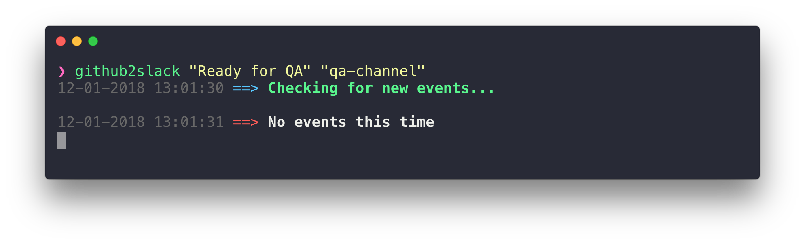
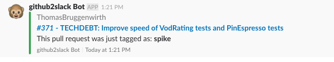

# github2slack [](https://www.npmjs.com/package/github2slack)

> Notify a slack channel when a label is added to a github pull request

<p align="center">
  
</p>

<p align="center">
  
</p>

## Install

```sh
git clone https://github.com/prepare-to-cry/github2slack
cd github2slack
npm link
```

### Rename the `.env-example` to `.env`
And replace the following variables accordingly

```
REPO_USERNAME=prepare-to-cry
REPO_NAME=github2slack
GITHUB_TOKEN=faketoken
SLACK_WEBHOOK=https://hooks.slack.com/services/BLABLABLA
```

## Usage

```
Usage

   $ github2slack <GITHUB_LABEL> <DESTINATION_SLACK_CHANNEL>
   
 Examples

   $ github2slack "Ready for QA" "qa-channel"    # Posts to #qa-channel when label is added
   $ github2slack "DevReady" "codereviews"       # Posts to #codereviews when label is added
```

## Created by
- [Cesar Ferreira](https://cesarferreira.com)
- [Thomas Bruggenwirth](https://github.com/tombruggenwirth)
